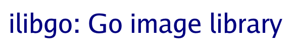
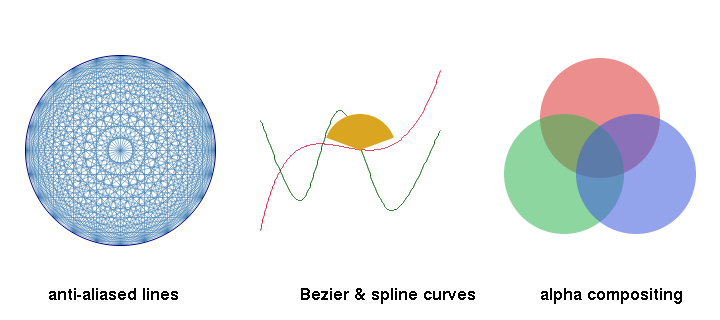
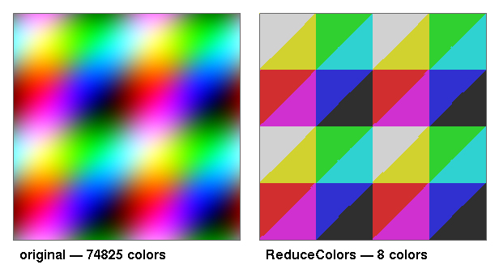
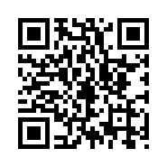
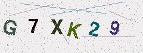
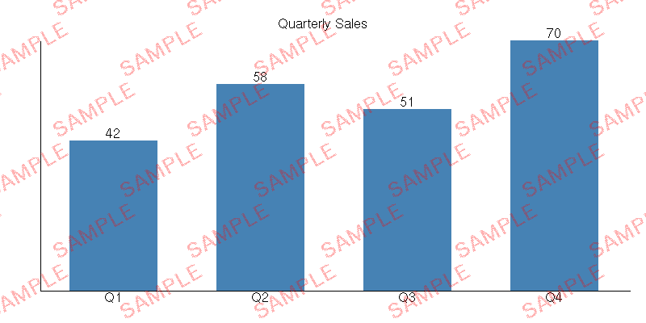
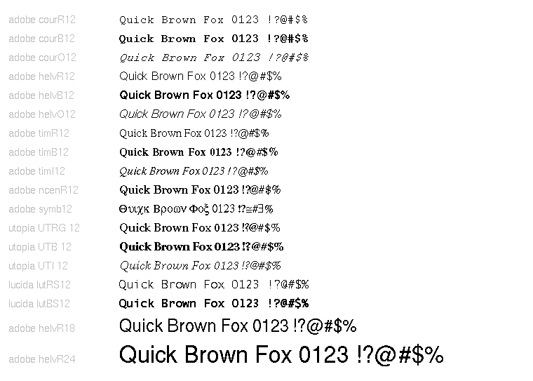

# ilibgo — Image Library for Go

[](https://pkg.go.dev/github.com/craigk5n/ilibgo)
[](https://goreportcard.com/report/github.com/craigk5n/ilibgo)
[](https://github.com/craigk5n/ilibgo/actions/workflows/ci.yml)
[](LICENSE)

`ilibgo` is a pure-Go library for reading, creating, manipulating, and saving
images, with a focus on simple drawing primitives and text rendering. It can
read any format the standard `image` package supports and draw text with both
embedded X11 BDF bitmap fonts and scalable, anti-aliased TrueType/OpenType
fonts.



## Gallery

These are produced by the bundled [example tools](#tools-and-examples).

### New in v2.1.0 — anti-aliasing, curves & compositing



*Anti-aliased drawing (`SetAntiAlias`), cubic Bezier / Catmull-Rom curves
(`DrawBezier` / `DrawSpline`), and source-over alpha compositing
(`SetBlendMode`), all new in v2.1.0. Generated by the
[`primitives`](primitives) example.*



*Median-cut color quantization (`ReduceColors`): a 74,000-color gradient reduced
to an 8-color palette. Generated by the [`reducecolors`](reducecolors) example.*

<table>
  <tr>
    <td align="center"><br><code>chart</code></td>
    <td align="center"><br><code>qrgen</code></td>
  </tr>
  <tr>
    <td align="center"><br><code>captcha</code></td>
    <td align="center"><br><code>sparkline</code></td>
  </tr>
  <tr>
    <td align="center"><br><code>watermark</code></td>
    <td align="center"><br><code>fontsheet</code></td>
  </tr>
</table>

## Features

- **Read** any format registered with the standard `image` package; **write**
  PNG, JPEG, GIF, BMP, TIFF, and PPM.
- **Drawing primitives**: points, lines, rectangles, arcs, circles, ellipses,
  polygons, Bezier/Catmull-Rom curves, flood fill, and (scaled) image copy.
- **Anti-aliasing & compositing**: optional anti-aliased lines/outlines/fills
  (`SetAntiAlias`), source-over alpha blending (`SetBlendMode`), and color
  reduction (`ReduceColors`).
- **Method-style API** on `*Image` (e.g. `img.FillRectangle(gc, ...)`); `*Image`
  implements the standard `image.Image` and `draw.Image` interfaces, so it drops
  into `image/draw`, the stdlib encoders, and `golang.org/x/image` scalers.
- **Text**: embedded X11 BDF bitmap fonts (with arbitrary-angle rotation and
  etched/shadowed styles) plus scalable, anti-aliased **TrueType/OpenType**.
- No required third-party dependencies beyond `golang.org/x/image`.

## Install

```sh
go get github.com/craigk5n/ilibgo
```

## Quick start

```go
package main

import (
	"os"

	"github.com/craigk5n/ilibgo"
	font "github.com/craigk5n/ilibgo/fonts/adobe_100dpi"
)

func main() {
	white, _ := ilibgo.AllocNamedColor("white")
	img := ilibgo.CreateImageWithBackground(240, 80, white)

	gc := ilibgo.CreateGraphicsContext()
	blue, _ := ilibgo.AllocNamedColor("steelblue")
	ilibgo.SetForeground(&gc, blue)
	img.FillRectangle(gc, 10, 10, 220, 60)

	// Draw text with a bundled bitmap font...
	f, _ := ilibgo.LoadFontFromData("helvB18", font.Font_helvB18())
	ilibgo.SetFont(&gc, f)
	white2, _ := ilibgo.AllocNamedColor("white")
	ilibgo.SetForeground(&gc, white2)
	img.DrawString(gc, 24, 50, "Hello, ilibgo!")

	// ...or with a scalable TrueType font:
	// tt, _ := ilibgo.LoadTrueTypeFromFile("Inter.ttf", "inter", 24, 72)
	// ilibgo.SetFont(&gc, tt)

	out, _ := os.Create("hello.png")
	defer out.Close()
	ilibgo.WriteImageFile(out, img, ilibgo.FormatPNG)
}
```

The drawing operations are methods on `*Image`. A `GraphicsContext` (passed by
value) carries the foreground/background color, font, and line/text style. The
older free-function forms (`ilibgo.FillRectangle(img, gc, ...)`) still work but
are deprecated in favor of the methods.

## Fonts

### Bitmap (BDF)

The bundled fonts are stored as `.bdf` files under [`fonts/`](fonts) and
compiled into the binary with [`go:embed`](https://pkg.go.dev/embed). Each
foundry is its own package exposing `Font_<name>() []string` accessors, which
you pass to `LoadFontFromData`. You can also load any `.bdf` at run time with
`LoadFontFromFile` (or from bytes with `LoadFontFromBytes`).

More BDF fonts are available from the
[X.Org font project](https://gitlab.freedesktop.org/xorg/font), and you can
edit or create them with [FontForge](https://github.com/fontforge/fontforge).
The [`bdftogo`](bdftogo) tool converts a `.bdf` into Go `[]string` source if you
prefer that to embedding the file.

### Scalable (TrueType / OpenType)

```go
f, _ := ilibgo.LoadTrueTypeFromFile("Inter.ttf", "inter", 32, 72) // path, name, points, dpi
ilibgo.SetFont(&gc, f)
img.DrawString(gc, x, y, "Smooth, anti-aliased text")
```

TrueType fonts render anti-aliased and support the etched/shadowed text styles.
Arbitrary-angle rotation (`DrawStringRotatedAngle`) is currently supported only
for BDF fonts.

### Bundled font license

Some Adobe/X.Org BDF fonts are bundled. Per their
[COPYING](https://gitlab.freedesktop.org/xorg/font/adobe-100dpi/-/blob/master/COPYING)
notice:

> Copyright 1984-1989, 1994 Adobe Systems Incorporated.
> Copyright 1988, 1994 Digital Equipment Corporation.
>
> Permission to use, copy, modify, distribute and sell this software and its
> documentation for any purpose and without fee is hereby granted, provided that
> the above copyright notices appear in all copies ... Adobe Systems and Digital
> Equipment Corporation make no representations about the suitability of this
> software for any purpose. It is provided "as is" without express or implied
> warranty.

## Tools and examples

Each is a `package main` under its own directory; run with `go run ./<dir>`.

| Tool | Description |
|------|-------------|
| [`sample`](sample) | Demonstrates the drawing and text API |
| [`primitives`](primitives) | Showcase of anti-aliasing, curves, and alpha compositing |
| [`reducecolors`](reducecolors) | Before/after demo of `ReduceColors` palette reduction |
| [`truetype`](truetype) | Render text with a scalable TrueType/OpenType font |
| [`chart`](chart) | Bar-chart generator from `label=value` data |
| [`sparkline`](sparkline) | Tiny inline trend graph from a number list |
| [`qrgen`](qrgen) | Render a QR code (see the [`qr`](qr) package) |
| [`barcode`](barcode) | Render a Code 39 barcode |
| [`captcha`](captcha) | Distorted-text CAPTCHA generator |
| [`watermark`](watermark) | Overlay a semi-transparent text watermark |
| [`mandelbrot`](mandelbrot) | Render the Mandelbrot set (per-pixel coloring) |
| [`fontsheet`](fontsheet) | Specimen catalog of the bundled fonts |
| [`montage`](montage) | Compose images into a labeled grid |
| [`displayfont`](displayfont) | Render a BDF font's glyphs to a sheet |
| [`bdfinfo`](bdfinfo) | Print a BDF font's metadata |
| [`thumbnails`](thumbnails) | Build a thumbnail index of images |
| [`iconvert`](iconvert) | Convert an image between formats |
| [`iresize`](iresize) | Resize an image with a selectable filter |
| [`webreport`](webreport) | Graph Apache access-log activity |
| [`bdftogo`](bdftogo) | Convert a `.bdf` font to Go source |

The [`qr`](qr) sub-package is a reusable, dependency-free QR Code encoder.

## Building and testing

```sh
go build ./...
go test ./...                 # unit tests
go test -race -cover ./...    # with the race detector and coverage
```

CI runs formatting, `go vet`, the race-enabled tests, and a coverage gate on
every push and pull request.

## History

This library was ported to Go from the original
[C version](https://github.com/craigk5n/ilib); the API stays close to the C
original (which was modeled after the X11 graphics functions), with the leading
`I` dropped from most names. See the [ChangeLog](ChangeLog.md) for release
history.

## License

Copyright (C) 2001-2022 Craig Knudsen, craig@k5n.us.

Released under the GNU Lesser General Public License v2.1 — see
[LICENSE](LICENSE). Bundled BDF fonts carry their own permissive notices (see
above).
