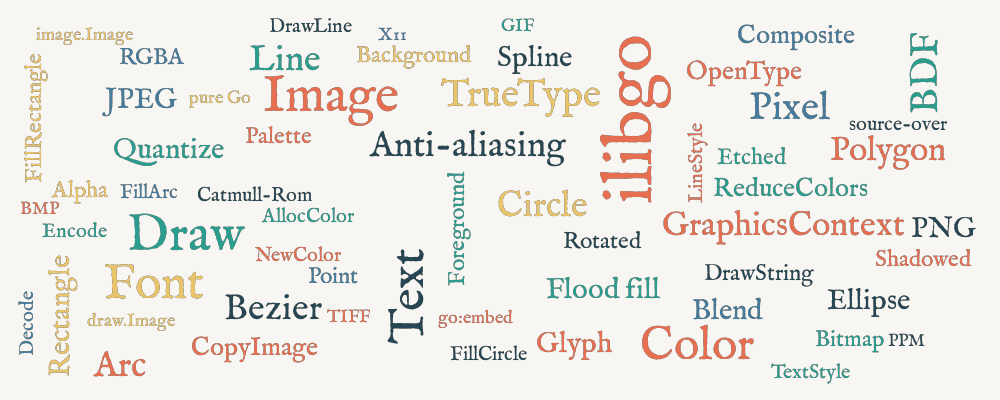

# wordcloud

Render a word cloud to a PNG, drawn entirely with the
[`ilibgo`](../) image library.



*Generated from [`ilibgo-features.json`](ilibgo-features.json).*

Words can come from a JSON config (with explicit per-word sizes and colors)
and/or from `count word` frequency lines on stdin, so it drops into a shell
pipeline as easily as it takes a hand-tuned config.

## Usage

```sh
go run . -config ilibgo-features.json            # render the bundled sample
go run . -config ilibgo-features.json -out cloud.png

# frequency mode: build a cloud from word counts
cat *.txt | tr ' ' '\012' | sort | uniq -c | sort -n | go run . -out cloud.png

# everything from flags, no config
go run . -bg white -palette "navy,teal,crimson" freq.txt
```

Run it from this directory so the relative `"font"` path in the sample configs
resolves.

### Flags

Flags override the matching config field when set.

| Flag | Default | Meaning |
|------|---------|---------|
| `-config` | – | JSON config file (see below) |
| `-out` | `wordcloud.png` | output PNG path |
| `-font` | built-in goregular | TrueType/OpenType font path |
| `-w`, `-h` | 800×600 | image dimensions |
| `-bg` | `black` | background color (name or `#rrggbb`) |
| `-palette` | – | comma-separated word colors |
| `-min`, `-max` | 14, 96 | min/max point size (for count-scaled words) |
| `-dpi` | 72 | rendering DPI |
| `-seed` | 1 | random seed for color **and** placement |

`preferHorizontal` and `margin` are config-only (no flags).

## Config format

```jsonc
{
  "width": 1000,
  "height": 400,
  "background": "#f7f6f2",      // color name or #rrggbb
  "font": "fonts/IMFellEnglish.ttf", // omit/empty = built-in goregular
  "dpi": 72,
  "margin": 16,                 // empty border (px) kept clear of words
  "minSize": 14,                // size for the least frequent word...
  "maxSize": 54,                // ...and the most frequent (count mode)
  "palette": ["#264653", "#2a9d8f", "#e76f51"], // random per-word pick
  "seed": 7,                    // change to reshuffle layout & colors
  "preferHorizontal": 0.85,     // P(word is horizontal); rest rotate 90°
  "words": [
    { "text": "ilibgo", "size": 54, "color": "#e76f51" },
    { "text": "TrueType", "size": 30 },   // no color -> random from palette
    { "text": "Bezier", "count": 12 }     // size derived from count instead
  ]
}
```

A word's point size comes from `size` when it is `> 0`; otherwise it is derived
from `count` via sqrt scaling between `minSize` and `maxSize` (so one very
frequent word doesn't dwarf the rest). A per-word `color` overrides the random
palette pick. Config is applied over the built-in defaults, then any
explicitly-set flags win on top.

### Notes

- **Skipped words.** If the words don't all fit, the tool places what it can and
  prints which ones were skipped. To fit more: enlarge the canvas, shrink the
  larger words, lower `preferHorizontal` (more rotation interlocks tighter), or
  try a different `seed`.
- **Reproducibility.** Same config + same `seed` ⇒ identical output. `seed`
  drives both color selection and placement.

## How placement works

Each word is rasterized to a glyph mask, then dropped at a random free position
(not spiralled out from the center), tested against an integral-image occupancy
map at glyph-pixel granularity — so smaller words nest into the whitespace of
larger ones, and big words spread across the whole canvas instead of stacking in
the middle. Words are placed largest-first; ~`preferHorizontal` of them stay
horizontal and the rest rotate 90° to interlock. See
[`layout.go`](layout.go) for details.

## Bundled fonts

[`fonts/`](fonts) ships a few open-licensed (SIL OFL) display faces, each with
its license alongside:

| File | Look |
|------|------|
| `IMFellEnglish.ttf` | Antique 17th-century letterpress (Oxford Fell types) |
| `IMFellDoublePica.ttf` | Same family, heavier/rougher display cut |
| `Rye.ttf` | Bold distressed Western slab serif |

Point `"font"` at any of these, at your own TrueType/OpenType file, or leave it
empty to use the built-in `goregular`. The OFL requires the license file to
travel with the font if you redistribute it.

## Sample configs

- [`ilibgo-features.json`](ilibgo-features.json) — the showcase above, built from
  ilibgo's own feature names.
- [`example.json`](example.json) — a minimal starting point.
